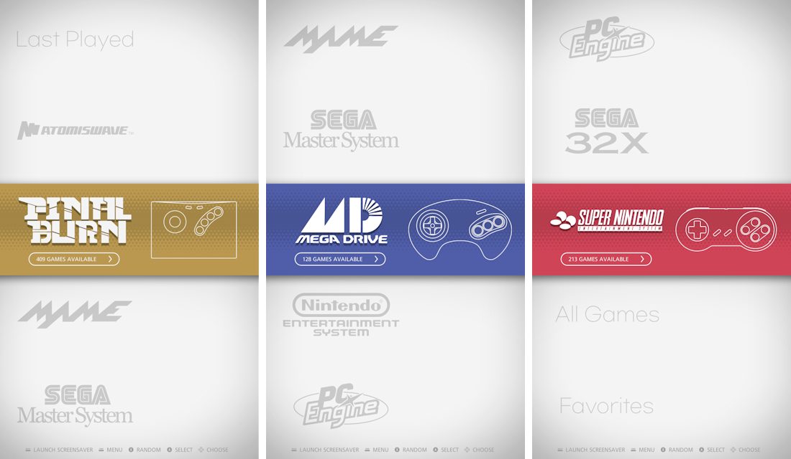

# ssimple v - vertical theme for Retropie Emulationstation
Theme 'SSIMPLE V'\
For use with vertical display
 
## Changelog
- v 1.1 Add 3:4 aspect ratio theme
- v 1.0

## How to use

### Recommended theme option:
- UI SETTINGS > TRANSITION STYLE: INSTANT
- UI SETTINGS > CAROUSEL TRANSITIONS: SLIDE (or NONE)

**You may need properly scrapped gamelist.xml-including video, image, marquee, thumbnail- for more organized view**

### Compatibility

**This theme is designed for use only on 16:9 vertical display**\
tested on 1080x1920 and 720x1280 resolution.

### Another aspect ratio

- theme.xml : 9:16 Portrait
- theme-P34.xml : 3:4 Portrait
- theme-L.xml : 16:9 Landscape
- theme-L43.xml : 4:3 Landscape

** rename original 'theme.xml' to 'theme.xml.ori' and then rename other file to 'theme.xml'**\
  eg : theme-34.xml to theme.xml will set the theme to 3:4 portrait

## License

Summary of the license below:
* ALLOWED:      - Share and duplicate as it is
                - Edit, alter, change it
* REQUIREMENTS: - Attribution, give credit to the creator
                - Indicate changes to it
                - Publish the changes under the same license
* PROHIBITED:   - Commercial distribution

## LOGO NOTICE
* The used logos and trademarks are copyright of their respective owners.

## Screenshots

## Video
